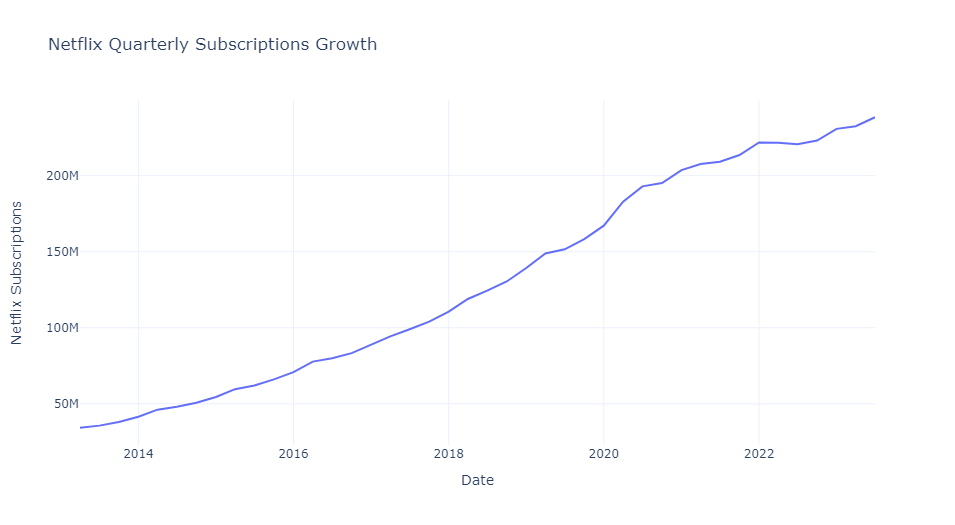
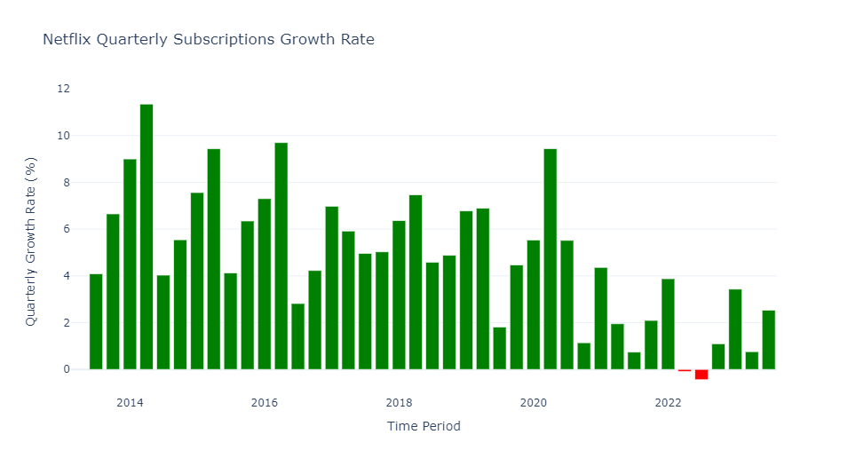
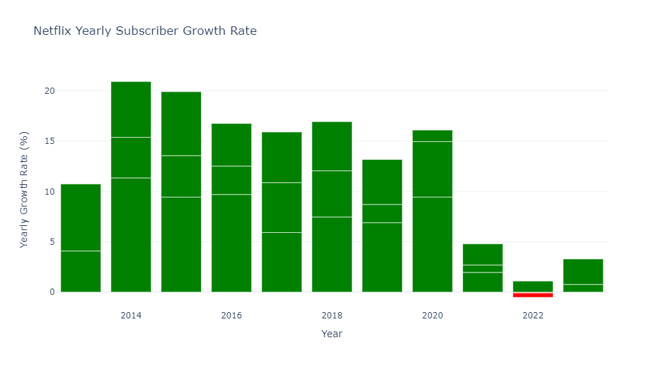
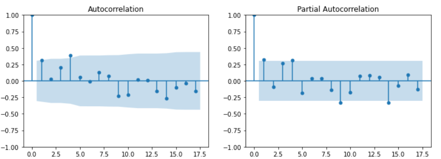
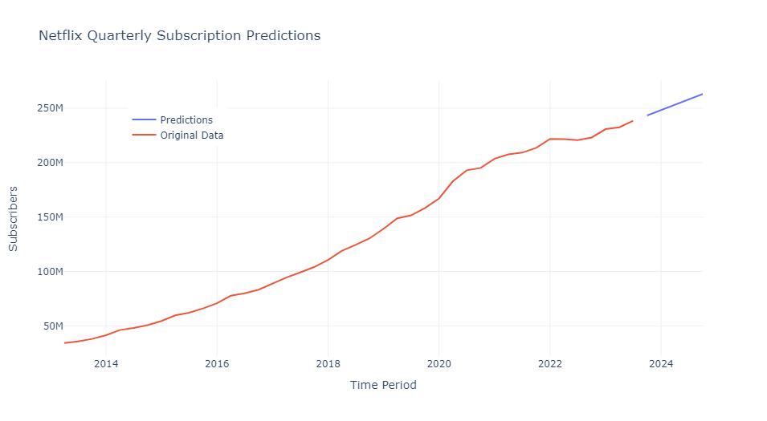

# Netflix-Subscription-Forecasting--ARIMA
Netflix Subscriptions Forecasting using ARIMA in Python
Using techniques like time series forecasting, Netflix can predict the expected number of new subscribers in a given time period and understand the growth potential of their business. Below is the process we can follow to forecast subscription counts for Netflix:

1. Gather historical Netflix subscriptions growth data
2. Preprocess and clean the data
3. Explore and analyze time series patterns
4. Choose a time series forecasting model (e.g., ARIMA, LSTM)
5. Train the model using the training data
6. Forecast future Netflix subscription counts

So the process for forecasting subscriptions for Netflix starts with collecting a dataset based on the historical growth of Netflix Subscribers. Dataset consists of Netflix subscriptions till Q3-2023.

Based on the dataset, plotting the quarterly subscription growth of Netflix

Since the Netflix subscribers growth is not seasonal, we can leverage forecasting technique like ARIMA in this dataset.

## Exploring ARIMA (AutoRegressive Integrated Moving Average) model
Overview and components of ARIMA Models
ARIMA models combine three distinct components:

1. Autoregression, represented as AR
2. Differencing, represented as I
3. Moving average, represented as MA
   
The autoregressive component captures the relationship between an observation and a predetermined number of lagged observations. Meanwhile, differencing is used to make a non-stationary time series stationary. And finally, the moving average component accounts for the impact of past errors on the current observation.

Stationarity and non-stationarity
Stationarity, as modified with differences, is a crucial aspect of ARIMA modeling. In a stationary time series, the mean, variance, and autocorrelation structure remain constant over time. Non-stationary time series, on the other hand, exhibit trends, seasonality, or other changing patterns.

ARIMA models are designed for stationary data, so ensuring your time series is stationary is essential to the modeling process. Differencing, as mentioned above, is often used to achieve stationarity by removing trends or seasonal patterns. The amount of differencing required is determined by the data itself and plays a key role in the overall performance of the model.

We calculate the quarterly growth rate using bar graph and plot quarterly subscription growth rate

Now, we calculate the yearly subsciption growth rate using bar graphs

### Determining model parameters
ARIMA models have three key parameters: the order of autoregression (p), the degree of differencing (d) and the order of the moving average (q). Selecting the optimal combination is essential for effective forecasting.

Determining the appropriate values for p and q requires examining the autocorrelation function (ACF) and partial autocorrelation function (PACF) plots of the time series data. The ACF plot displays the correlation between an observation and its lagged values, while the PACF plot shows the direct effect of lagged values on the current observation, removing any indirect effects. A sharp cut-off in the PACF plot suggests the optimal p value, while a gradual decline indicates the ideal value for q.

For the differencing parameter d, start with a value of 0 or 1, then incrementally increase it until the time series is stationary. However, the excessive differencing can lead to overfitting and reduced forecasting accuracy.

### Fitting ARIMA models
Once you’ve determined the optimal (p, d, q) parameters, fit your ARIMA model to the training set using statistical software or programming languages like Python or R. While fitting the model, pay close attention to its residuals, as they provide crucial information about the model’s performance. Ideally, the residuals should be white noise, indicating that the model has captured the underlying structure of the data.

Now we find the value of p and q by plotting the ACF and PACF of differenced time series.

Here we first calculated the differenced time series from the original time_series, removed any NaN values resulting from the differencing, and then plotted the ACF and PACF to provide insights into the potential order of the AR and MA components in the time series. These plots are useful for determining the appropriate parameters when using the ARIMA model for time series forecasting.

Based on the plots, we find that p=1 and q=1. The ACF plot cuts off at lag 1, indicating q=1, and the PACF plot also cuts off at lag 1, indicating p=1. As there is a linear trend in the subscription growth rate, we can set the value of d as 1 to remove the linear trend, making the time series stationary.

And implement the ARIMA model in our dataset-

Visualizing the results of Netflix Subscriptions Forecasting for the next five quarters:

